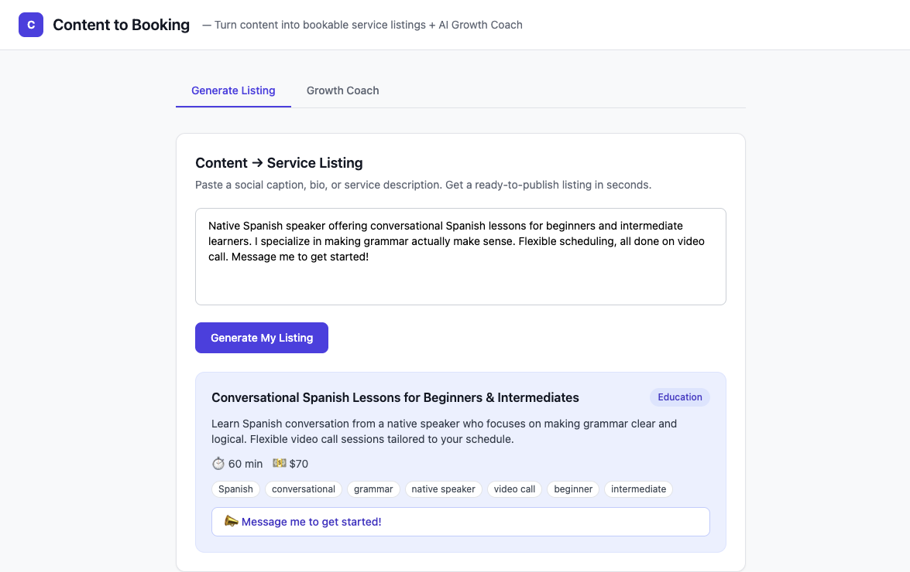
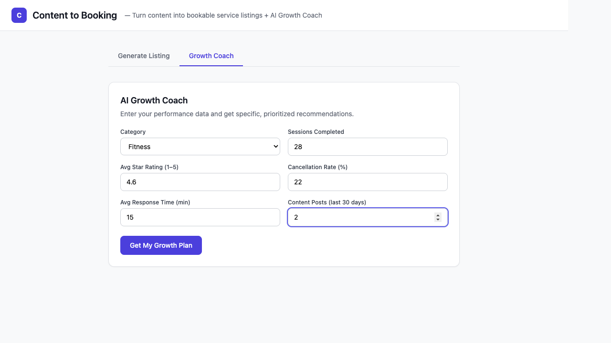
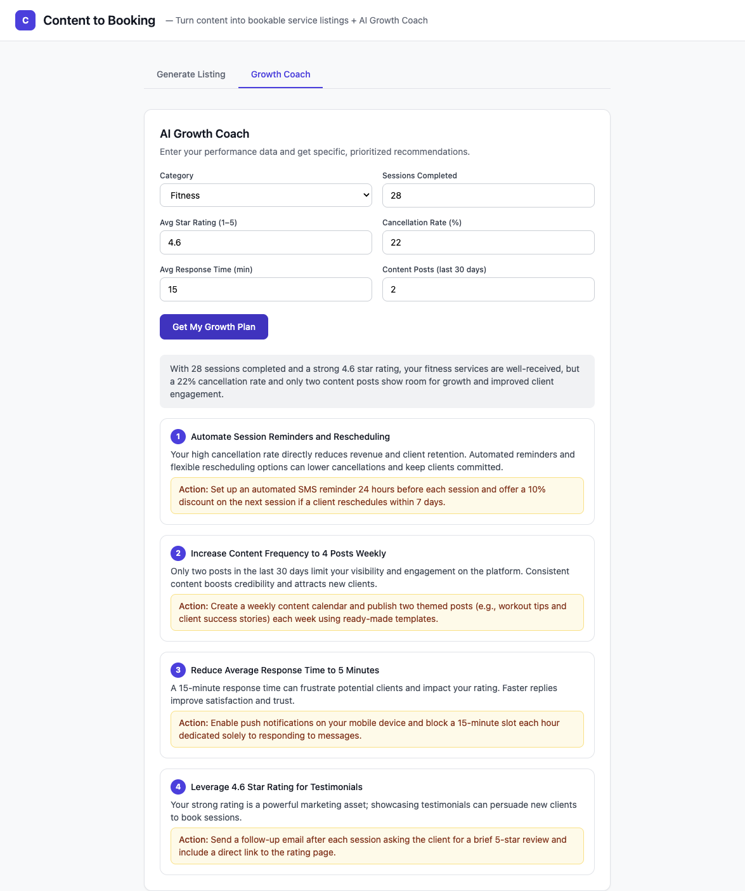

# Content to Booking

Independent service providers (tutors, coaches, trainers, wellness practitioners) post content on social media but have no direct path from that content to a bookable service listing. This tool closes that gap.

Two modules:

1. **Content → Booking Generator** — paste a social caption, bio, or service description; get a structured, ready-to-publish service listing instantly
2. **AI Growth Coach** — enter provider performance metrics; get specific, prioritized recommendations for growing your business

## Demo

> This is a working proof-of-concept. Both modules call a live LLM via [OpenRouter](https://openrouter.ai) — no mocks or hardcoded responses.

### Content → Service Listing

Paste any raw provider content (social caption, bio, description) and get a structured listing back in seconds.



### AI Growth Coach

Enter provider performance metrics and get numbered, prioritised, metric-specific recommendations.





## Setup

### 1. Get a free API key

Sign up at [openrouter.ai](https://openrouter.ai) — no credit card required. OpenRouter gives access to many free models out of the box.

### 2. Run

```bash
OPENROUTER_API_KEY=sk-or-... go run .
```

Then open [http://localhost:8080](http://localhost:8080).

### 3. (Optional) Use a different model

The default model is `meta-llama/llama-3.3-8b-instruct:free`. Override it with:

```bash
OPENROUTER_API_KEY=sk-or-... OPENROUTER_MODEL=google/gemini-2.0-flash-exp:free go run .
```

Browse all free models at [openrouter.ai/models?q=free](https://openrouter.ai/models?q=free).

## Example Inputs

### Generate Listing

**1 — Meditation coach**

> Ready to finally quiet the noise? 🧘 I offer 1:1 guided meditation sessions designed for stressed-out professionals. 30 or 60 min sessions via Zoom. 5 years teaching mindfulness, 200hr certified. Book your free intro call via the link in bio.

**2 — Language tutor**

> Hola! 🇪🇸 Native Spanish speaker offering conversational Spanish lessons for beginners and intermediate learners. I specialize in making grammar actually make sense. Flexible scheduling, all done on video call. Message me to get started!

**3 — Personal trainer**

> Summer shred season is HERE 💪 I build custom 8-week programs for people who've tried every plan but can't stay consistent. Online coaching + weekly check-ins. Spots limited — DM "READY" if you want to start this week.

### Growth Coach

**Provider A — High cancellation, low content**

- Category: Fitness, Sessions: 28, Rating: 4.6, Cancellation: 22%, Response time: 15 min, Posts: 2

**Provider B — Great content, slow response**

- Category: Wellness, Sessions: 61, Rating: 4.8, Cancellation: 5%, Response time: 180 min, Posts: 18

**Provider C — New provider, low volume**

- Category: Education, Sessions: 8, Rating: 5.0, Cancellation: 0%, Response time: 10 min, Posts: 1

## Project Structure

```
├── main.go                 # HTTP server, routes, CORS
├── handlers/
│   ├── generate_listing.go # POST /api/generate-listing
│   ├── growth_coach.go     # POST /api/growth-coach
│   └── helpers.go          # Shared JSON error helper
├── llm/
│   └── openai.go           # OpenRouter client (OpenAI-compatible)
├── models/
│   ├── listing.go          # ServiceListing struct
│   └── coaching.go         # ProviderMetrics + CoachingReport structs
└── static/
    └── index.html          # Single-page frontend (Tailwind CSS)
```

## API

| Method | Path                    | Body                   | Returns               |
| ------ | ----------------------- | ---------------------- | --------------------- |
| `POST` | `/api/generate-listing` | `{ "content": "..." }` | `ServiceListing` JSON |
| `POST` | `/api/growth-coach`     | `ProviderMetrics` JSON | `CoachingReport` JSON |
| `GET`  | `/health`               | —                      | `{ "status": "ok" }`  |
